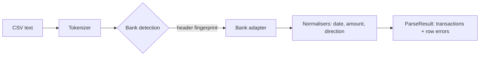

[](https://github.com/R1chi33333/nz-bank-parser/actions/workflows/ci.yml)
[](https://codecov.io/gh/R1chi33333/nz-bank-parser)
[](./LICENSE)

# nz-bank-parser — one clean transaction format for NZ bank CSV exports

[Live Playground](https://nz-bank-parser.vercel.app) · [Documentation](#getting-started) · [Report Bug](https://github.com/R1chi33333/nz-bank-parser/issues/new?template=bug_report.md)

> Status: v0.x — core parsing and playground complete, npm publish lands with v1.0.0.

## Why this exists

Every New Zealand bank exports transaction CSVs in its own dialect: different date formats, different column names, different sign conventions. Anyone building a budgeting tool, expense splitter or accounting import ends up rewriting the same brittle parsing code. This library does it once, properly, with zero dependencies.

## Features

- Parses CSV exports from ANZ, ASB, Westpac and Kiwibank
- Auto-detects the bank from header fingerprints, or accepts an explicit `bank` option
- Normalises everything to one model: ISO dates, amounts in cents, explicit debit/credit direction
- Never throws away a whole file: bad rows are collected as structured errors, good rows still parse
- Handles BOM, quoted commas, CRLF, empty lines, negative signs and parenthesised amounts
- Zero runtime dependencies, dual ESM/CJS, full TypeScript types

## Format support

| Bank     | Export                                       | Header verified against                           | Dates      | Balance column |
| -------- | -------------------------------------------- | ------------------------------------------------- | ---------- | -------------- |
| ANZ      | Internet Banking transaction history CSV     | ANZ help pages and independent tooling docs       | DD/MM/YYYY | No             |
| ASB      | FastNet Classic CSV (with metadata preamble) | Accounting software import guides                 | YYYY/MM/DD | No             |
| Westpac  | Online banking CSV                           | Westpac published export documentation            | DD/MM/YYYY | No             |
| Kiwibank | Full CSV                                     | Accounting import guides only (no published spec) | DD-MM-YYYY | Yes            |

Detection is fingerprint-based on the header row. If your bank changes its export and detection fails, pass `{ bank: '...' }` explicitly and [open an issue](https://github.com/R1chi33333/nz-bank-parser/issues/new?template=bug_report.md) with the new header row.

## Architecture



## Tech Stack

TypeScript (strict), tsup (ESM + CJS), Vitest, GitHub Actions, semantic-release. Playground: Vite, React, Tailwind CSS.

## Getting Started

```bash
npm install nz-bank-parser
```

```ts
import { parse } from 'nz-bank-parser';

const result = parse(csvContent); // bank auto-detected
// or: parse(csvContent, { bank: 'anz' })

for (const tx of result.transactions) {
  console.log(tx.date, tx.direction, tx.amount, tx.description);
}
console.log(result.errors); // rows that could not be parsed, with reasons
```

## Testing

```bash
npm test               # unit tests
npm run test:coverage  # with coverage report (threshold: 90 percent)
```

All fixtures are synthetic. No real bank statements are used anywhere in this repository.

## Roadmap

See [ROADMAP.md](./ROADMAP.md).

## License

[MIT](./LICENSE)
